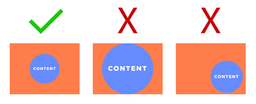
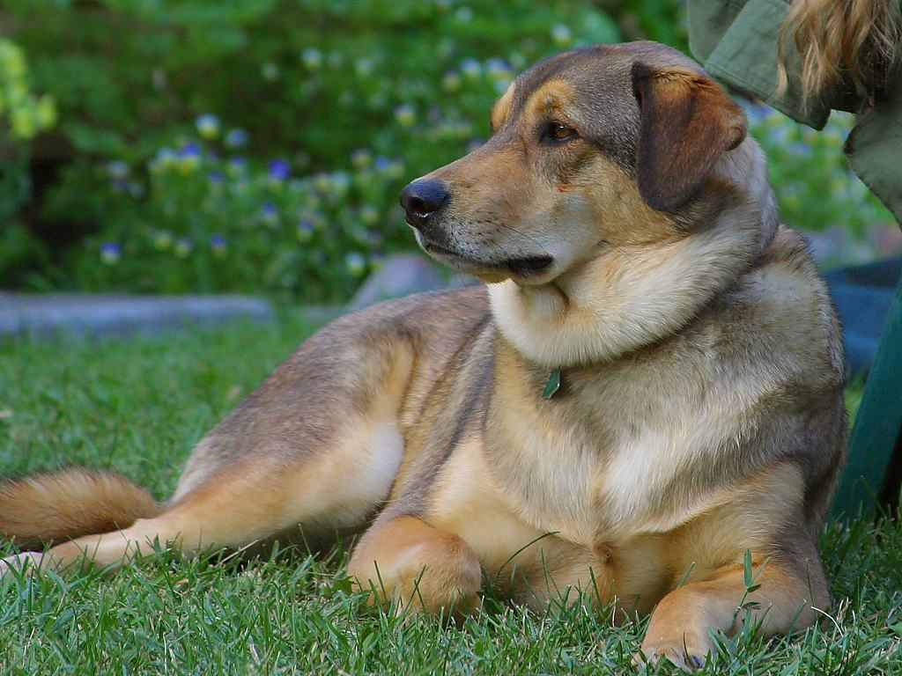
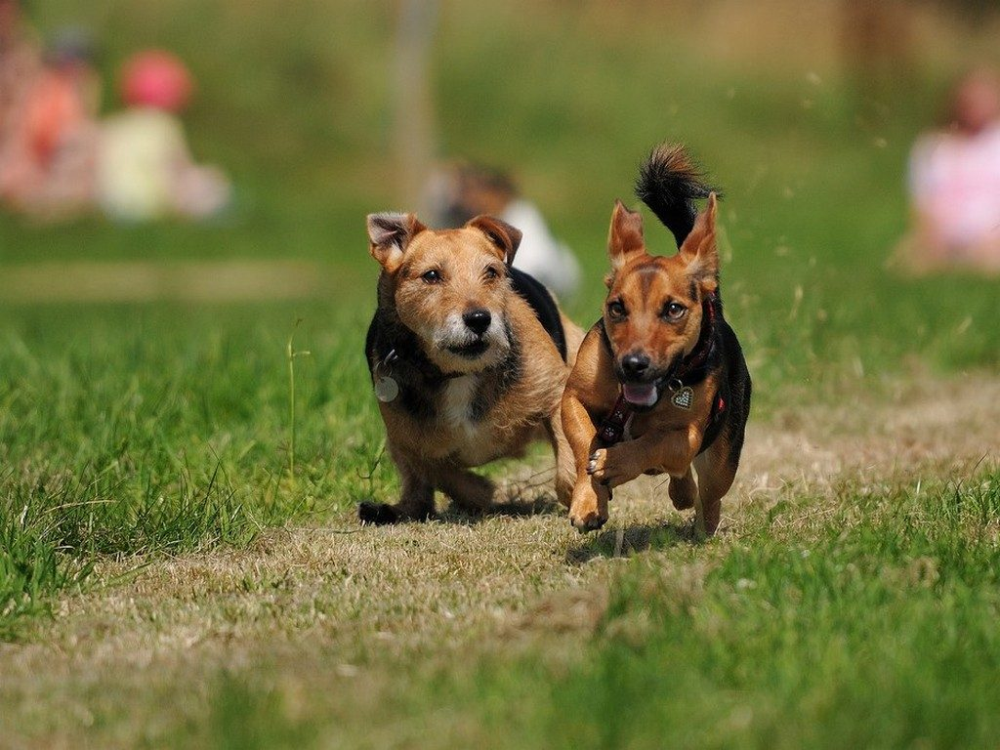

# Responsive Images

## Basic Rules

Select images were all relevant content is:

* Centered in the frame
* Spaced far away from the edges of the frame

## Sizes

As the size of the **viewport** changes, sometimes the **dimensions** of images on a site must also change, so that the design continues to look good. Usually, these are images whose **dimensions** are dependant on, or relative to, the size of the **viewport**.

In the above example you have an image that is *always as wide as the* ***viewport*** but *always `350px` tall*.

This shows how the appearance of the website will change as the size of the **viewport** changes. As you can see, the sides of the image are no longer shown: Instead of seeing both mountains and the sun, we see only one moutain, part of a second, and no sun. We are seeing *only as much of the image as the rules allow*, those rules being "always full width, and always `350px` high."

In this situation, we would say that the image has a **dynamic ratio**: this means that the **ratio** of the image (the relationship of its height to its width) changes as the size of the **viewport** changes.

The other type of **ratio** is a **fixed ratio**. This means that the **ratio** of the image does not change as the **viewport** changes, but the **dimensions** at which it is displayed may change to maintain that ratio.

On the desktop, the image was `1000px` by `333px`, so it had a **ratio** of 3:1. Since this **ratio** is static, it is maintained as the **viewport** gets smaller, so in our mobile **viewport** (which is `300px` wide) the image is now `300px` by `100px`. 

> **Note:** These numbers are rounded to make them a bit easier to understand.

## Focus

In traditional photography, framing is important: the photographer composes an image that relates to where its edges are, and in many cases includes important content that goes all the way up to those edges, or content that is heavily weighted to one side or corner of the image. 

For images that are going to be used in websites, especially images that will have a **dynamic ratio** when they appear on a website, this type of framing is often not good. This is because images can and will be **masked** or **cropped** in a variety of different ways, which can cause relevant content in your image to disappear.

This is a good dog, but it is not a good photo for the web. The focus is in the upper right, on the dog's head. If we try to use this in the **desktop viewport** from above, it will end up looking like this:

The solution to this problem is to pick images where *the import content is centered* and *distant from the edges of the image*. This means that even as the **mask** or **crop** changes, the important content in your image is still preserved. 

For instance, take these good dogs:

Because they're centered, and there's plenty of space between them and the edges of the photo, they still look fine in our theoretical design:

